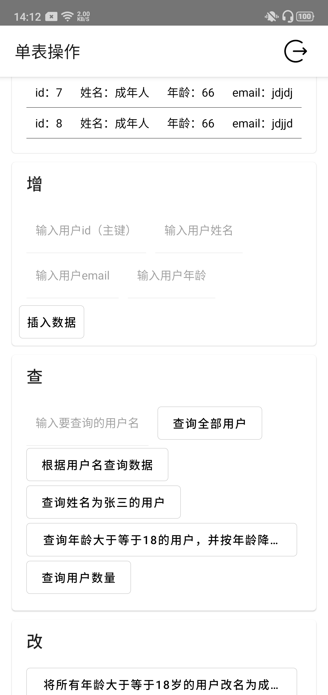
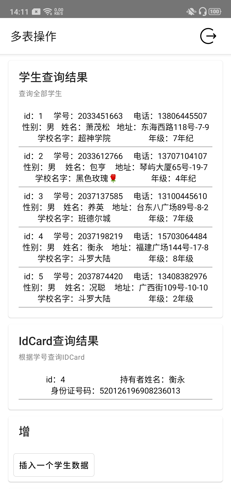

## 介绍
在react-native中使用greenDAO操作SQLite，存储速度有质的飞跃，也轻松应对存储具有复杂关系的数据

已有操作单个表、一对一关系的功能，后面将加入一对多、多对多关系的数据库操作

## 单表操作

## 一对一关系

一个学生Student只有一个身份证IDCard，一对一关系,student id为IdCard的外键

## 一对多关系

一个学生Student有多个信用卡CreditCard

##### 参考文章

- [一篇好文之Android数据库 GreenDao的使用指南(源码+案列)](https://blog.csdn.net/qq_32175491/article/details/82913904)

- [GreenDAO 完美解决数据库升级数据丢失问题](https://blog.csdn.net/qq_35956194/article/details/79167897)

- [GreenDao教程(3)：一对一，一对多，多对多](https://blog.csdn.net/RobotHost/article/details/70098744)

### 功能

- [x] 单表操作
- [x] 升级数据库不丢失数据
- [x] 一对一关系操作
- [x] 一对多关系操作
- [ ] 多对多关系操作
